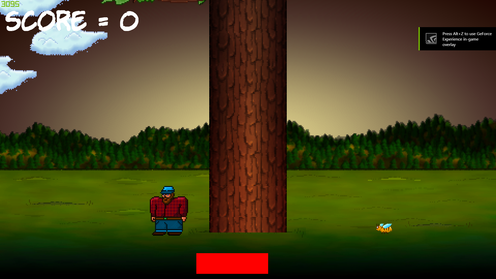

# Timber
This is a game I learned how to make in C++ using visual studio.  I learned how to make this game by reading a book on game development in C++. 
The book can be purchased on the websites:

https://www.amazon.com/Beginning-Game-Programming-John-Horton/dp/1786466198

or

https://www.packtpub.com/game-development/beginning-c-game-programming

Here are some images of the game in work:

